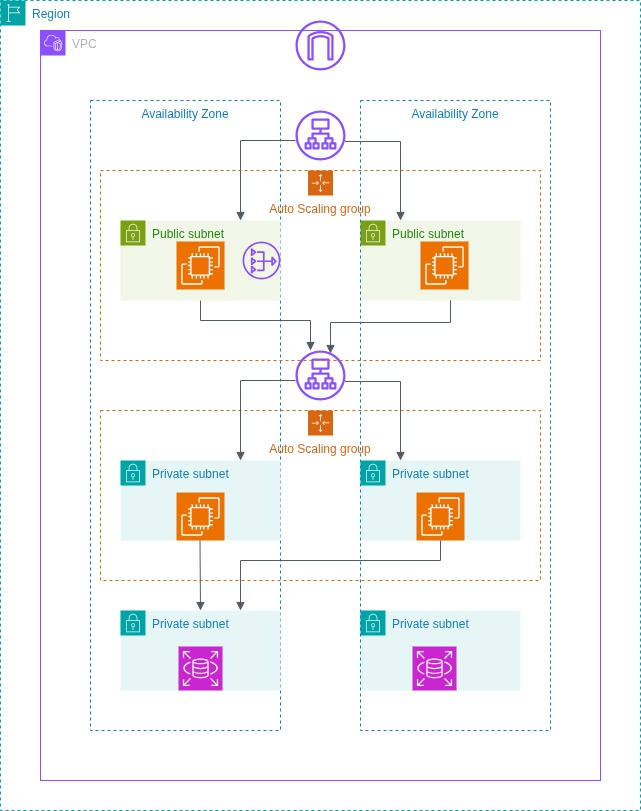

# 🌐 3-Tier Architecture Deployment on AWS

## 📘 Overview

This project implements a scalable and highly available **3-tier architecture** on **Amazon Web Services (AWS)**, designed using best practices for isolation, resilience, and automation.

It consists of:
- **Tier 1 (Web Layer)**: Public-facing EC2 instances behind an internet-facing load balancer.
- **Tier 2 (Application Layer)**: Private EC2 instances for backend logic behind an internal load balancer.
- **Tier 3 (Database Layer)**: A managed MySQL database using Amazon RDS in private subnets.

Each tier is deployed across **two Availability Zones (AZs)** for high availability and fault tolerance.

---

## 🧱 What is a 3-Tier Architecture?

A **3-tier architecture** is a well-established software pattern used to organize applications into three distinct layers:

1. **Presentation Tier** – The user interface (frontend).
2. **Application Tier** – Business logic and API processing (backend).
3. **Data Tier** – Data persistence using databases or file storage.

This separation ensures:
- Better **security** by isolating tiers.
- Easier **maintenance** and **scalability**.
- Improved **fault tolerance** and **availability**.

---

## 🛠️ Architecture Components

### 🔹 Tier 1 – Presentation Layer (Public Subnet)
- **Internet-Facing Application Load Balancer (ALB)**: Receives incoming traffic from users.
- **Auto Scaling Group (ASG)**: Manages EC2 web instances based on load.
- **Target Group**: Registers EC2 instances in public subnets.
- **EC2 Instances**: Web servers (e.g., Apache or NGINX).

### 🔸 Tier 2 – Application Layer (Private Subnet)
- **Internal Application Load Balancer (ALB)**: Routes traffic from Tier 1 to Tier 2.
- **Auto Scaling Group (ASG)**: Manages backend EC2 instances.
- **Target Group**: Registers backend EC2 instances.
- **EC2 Instances**: Host backend application logic.

### 🔻 Tier 3 – Data Layer (Private Subnet)
- **Amazon RDS (MySQL Engine)**: Relational database managed by AWS.
- **Deployed in Private Subnets** for security and isolation.
- **Multi-AZ deployment** enabled for high availability.
> In an Amazon RDS Multi-AZ deployment, Amazon RDS automatically creates a primary database (DB) instance and synchronously replicates the data to a standby instance in a different Availability Zone (AZ).  
> When it detects a failure, Amazon RDS automatically fails over to the standby instance without manual intervention—ensuring minimal downtime and business continuity.

---

## 🏗️ High Availability Design

- Deployed across **2 Availability Zones**.
- Load balancers and auto scaling ensure zero downtime and dynamic scaling.
- RDS uses **Multi-AZ** to provide automatic failover in case of DB instance failure.

---

## 🔐 Security Considerations

- **Public Subnets** only allow HTTP/HTTPS traffic.
- **Private Subnets** have no direct access to the internet.
- **Security Groups** control access between tiers (web → app → database).

---

## 🌐 Visual Architecture Diagram

---

